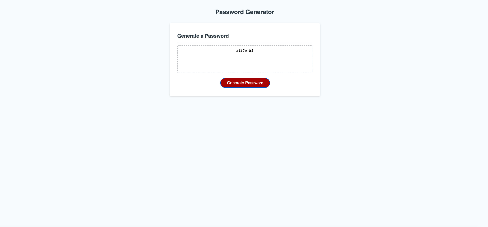

# Random Password Generator

## Description

This application will randomly generate a password based on criteria that the user provides when prompted. Your password must be between 8-128 characters and you will be prompted with questions asking if you would like upper case letters, lower case letters, number and special characters. 

## Table of Contents

- [Installation](#installation)
- [Usage](#usage)
- [Credits](#credits)
- [License](#license)

## Installation

To run this password generator you will need to clone the GitHub repository to your local machine. Run the following command in your git bash: 
```bash
git clone git@github.com:marissa424/Password-Generator.git
```
after you have cloned the repository onto your local computer open your code in VS Code or any other coding editor and right click to open your html file in the web broswer and you will be able to run the application and generate your password. 

## Deployed Application
(https://marissa424.github.io/Password-Generator/)

## Usage
   

  

## Credits

- Coursework from Coding Boot Camp module 1 referenced for guidance.
- Information from https://w3collective.com/

## License

This repository is licensed under the [MIT license](https://choosealicense.com/licenses/mit/).

---

## How to Contribute

To suggest an idea or report a bug, please create an issue. Or, submit a pull request from your fork to the original repository for review.


